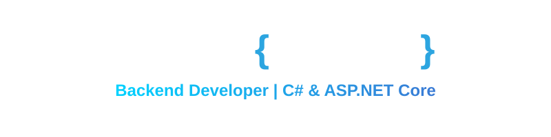

  <picture>
    <source media="(prefers-color-scheme: dark)" srcset="header.svg">
    <source media="(prefers-color-scheme: light)" srcset="header.svg">
    
  </picture>

 

  
  
  

  
  
  

 

<h3 align="center">🛠️ Технологический стек</h3>

  

  

 

<h3 align="center">📊 Статистика активности</h3>

  
  

  

 

<h3 align="center">🌊 График активности за год</h3>

  

 

  

